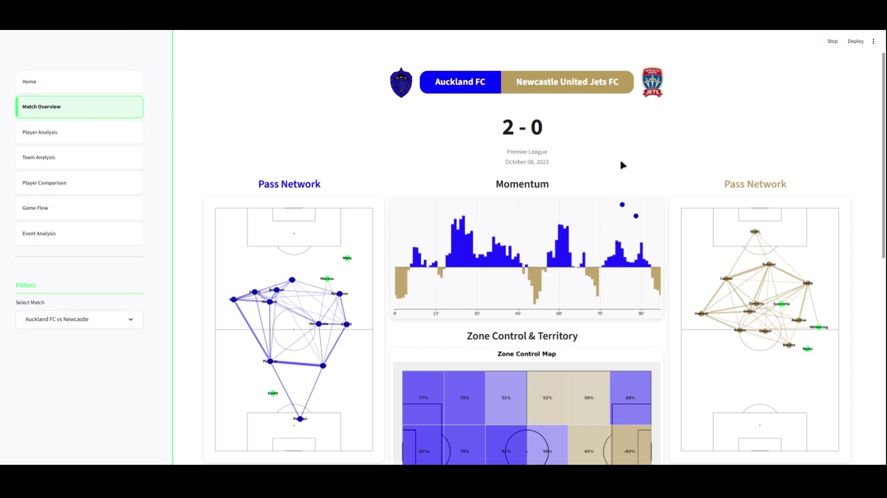

<div align="center">


&nbsp;&nbsp;&nbsp;&nbsp;


</div>

# Football Match Intelligence

> *A comprehensive football analytics platform for the SkillCorner X PySport Analytics Cup*

---

## 📊 Project Description

**Football Match Intelligence** is an interactive web application that transforms SkillCorner tracking data into actionable tactical insights. Built with Streamlit and Python, this platform provides coaches, analysts, and football enthusiasts with professional-grade match analysis tools through an intuitive interface.

The system processes high-frequency positional data (10Hz tracking) combined with discrete event metadata to enable multi-dimensional analysis: from aggregate team metrics and spatial visualizations to frame-by-frame tactical reconstructions. Whether you're preparing match reports, scouting players, or exploring tactical patterns, Football Match Intelligence delivers the depth and precision needed for modern football analysis.

**Key capabilities:**
- **Match Overview**: Aggregate statistics, pass networks, shot maps, momentum analysis
- **Player Profiling**: Heatmaps, speed zones, movement patterns, event timelines
- **Team Analysis**: Defensive structure, field tilt, possession chains, phase-based networks
- **Head-to-Head Comparison**: Pizza charts, spatial overlap, dominance mapping
- **Temporal Analysis**: Cumulative xG, possession timelines, momentum tracking
- **Event Reconstruction**: Frame-by-frame playback with tactical overlays and passing options

---

## Competition Submission

### About This Project

This is my submission for the SkillCorner X PySport Analytics Cup (Analyst Track). I built a web app that helps you dig deep into football matches using SkillCorner's tracking data. Think of it as your tactical analysis toolkit - from watching how teams move around the pitch to comparing players head-to-head.

The cool part? It's all interactive. You can click through different matches, pick players to analyze, and see everything from heatmaps to tactical boards that show exactly what's happening on the pitch.

### What's It Good For?

I designed this with a few people in mind:

**For Coaches and Analysts**: You can review your last match in detail - see where you lost possession, which zones you dominated, how your pressing worked. The tactical board even shows you passing options frame by frame.

**For Scouts**: Need to compare two midfielders? The pizza charts and proximity maps make it super easy to see who's better at what, and where they operate on the pitch.

**For Tactics Nerds**: If you love watching football and understanding the "why" behind what happens, this gives you the tools to explore that. Zone control, momentum charts, possession timelines - it's all there.

### How to Run It

It's pretty straightforward:

```bash
# 1. Grab the code
git clone [your-repo-url]
cd football-match-intelligence

# 2. Set up a Python environment
python -m venv .venv

# 3. Activate it
# Windows:
.venv\Scripts\activate
# Mac/Linux:
source .venv/bin/activate

# 4. Install what you need
pip install -r requirements.txt

# 5. Fire it up!
streamlit run Home.py
```

Your browser should pop open automatically at `http://localhost:8501`. If not, just visit that URL.

### Live Demo
🚀 **[View Live Application](https://football-match-intelligence.streamlit.app/)** - Explore the full interactive platform deployed on Streamlit Cloud


### Video Walkthrough
[](assets/video/Football_Match_Intelligence.mp4)
*_Click the image above to watch the video walkthrough_*

---

## What Can It Do?

I built six different analysis pages, each focusing on a specific aspect of the game:

### Match Overview
Your starting point. See the final score, check out pass networks for both teams, track match momentum, and look at shot maps with expected goals. It's basically everything you'd want to know about a match at a glance.

### Player Analysis
This is where you can really deep-dive on individual players. Four tabs cover everything:
- Where they played (heatmaps and territory coverage)
- How much they ran (speed zones, distance covered, sprint stats)
- Their movement patterns (what types of runs they make)
- Every touch they had (interactive timeline you can scrub through)

### Team Analysis  
Team-level stuff like how high they press, their defensive line shape, and sequences that led to chances. You can filter pass networks by phase too - see how a team builds up vs how they attack in the final third.

### Player Comparison
Pick two players and put them head-to-head. Pizza charts show you the quick comparison, but you can also see proximity maps (where they battled) and delta heatmaps (who dominated which areas).

### Game Flow
Ever wonder when the momentum shifted? This page shows you. Cumulative xG tells you when chances were created, momentum bars show who was on top, and the possession timeline shows how the ball moved between teams.

### Event Analysis
This is my favorite bit. You get a tactical board that shows exactly what was happening at any moment - passing options appear as colored circles with arrows, the player with the ball gets highlighted, and it all adjusts automatically based on which way teams are attacking. Plus there's an animation player so you can watch it frame by frame.

---

## What Makes It Different?

### The Tactical Board Thing
I spent a lot of time getting this right. When you look at an event:
- **Passing options**: Big green or blue circles around players who could receive the ball, with arrows showing where the pass would go
- **Possession**: A dashed circle highlights who has the ball
- **Smart positioning**: It figures out which way teams are attacking and shows events in the right spot (no more mirrored weirdness)

### The UI
I wanted it to feel professional but not intimidating. Green accent colors ('Solution Green' if you care about the hex code), smooth animations when you hover over navigation items, and a persistent green bar on the left that shows which page you're on.

Everything's consistent too - the "Filters" dropdown is in the same spot on every page, makes it easier to navigate.

### Under the Hood  
Some technical stuff that matters:
- Gap-aware smoothing (so velocities don't spike when tracking data has gaps)
- Sprint efficiency that actually runs fast (I optimized it from  O(n³) to O(n log n) - basically it went from unusably slow to instant)
- Detection rate filtering (throws out frames where too many players are guessed rather than tracked)
- Works with data straight from GitHub (no huge files to download)

---

## Installation

Just need Python 3.8 or newer.

```bash
# Make a virtual environment
python -m venv .venv

# Turn it on
# Windows:
.venv\Scripts\activate
# Mac/Linux:
source .venv/bin/activate

# Install dependencies
pip install -r requirements.txt
```

---

## How It's Organized

Here's what's where:

**`Home.py`** - The landing page, sets up styling and navigation

**`pages/`** - The six analysis pages (Match Overview, Player Analysis, etc.)

**`src/data_loader.py`** - Grabs data from GitHub or your local drive

**`src/preprocessing/`** - Cleans up tracking data, calculates velocities

**`src/metrics/`** - Fancy stuff like pitch control and team compactness

**`src/visualizations/`** - All the charts and the tactical board

**`src/utils/`** - Helper functions for geometry, team colors, logos

**`src/styling.py`** - The CSS that makes it look nice

**`tests/`** - Tests to make sure things work

---

## Documentation

I wrote detailed guides for each section (with screenshots):

- [**Introduction**](documentation/introduction.md) - Start here if you're new
- [**Match Overview**](documentation/match_overview.md) - Pass networks, shots, momentum
- [**Player Analysis**](documentation/player_analysis.md) - Heatmaps, speed zones, movement
- [**Team Analysis**](documentation/team_analysis.md) - Field tilt, defensive structure
- [**Player Comparison**](documentation/player_comparison.md) - Pizza charts, head-to-head
- [**Game Flow**](documentation/game_flow.md) - xG, momentum, possession timeline
- [**Event Analysis**](documentation/event_analysis.md) - Tactical board, animations
- [**Setup Guide**](documentation/setup.md) - Troubleshooting and installation help
- [**Data Dictionary**](documentation/data.md) - What all the metrics mean

---

## Competition Requirements

Making sure I hit all the points:

✅ Data loads from GitHub (SkillCorner Open Data repository)  
✅ Tracking smoothing handles gaps properly  
✅ Event coordinates work correctly  
✅ Interactive visualization with the tactical board  
✅ Pizza charts for player comparison  
✅ Fresh install works (tested with just requirements.txt)  
✅ Streamlit web app as main interface  
✅ Abstract is 300 words (see top of this file)  
✅ Run instructions included above  

---

## Cool Technical Bits

**Performance**: That sprint efficiency calculation used to take forever (like 30+ seconds). I rewrote it with binary search and now it's done in ~50ms. Makes a huge difference when you're clicking through players.

**Data Quality**: The detection rate filter is subtle but important - it removes frames where too many player positions are extrapolated. Keeps the heatmaps and stats more reliable.

**UI Details**: The green left border on the active page, the slight shift when you hover over navigation - these little touches make it feel more polished. Also made sure "Filters" is always in the same spot so you're not hunting for it.

**Coordinate Magic**: Getting event positions to match tracking data was tricky. Different coordinate systems, teams attacking different directions - the tactical board now handles all that automatically. You don't have to think about it, it just works.

---

*Built by Tiago Monteiro for the SkillCorner X PySport Analytics Cup*  
*December 2025*
