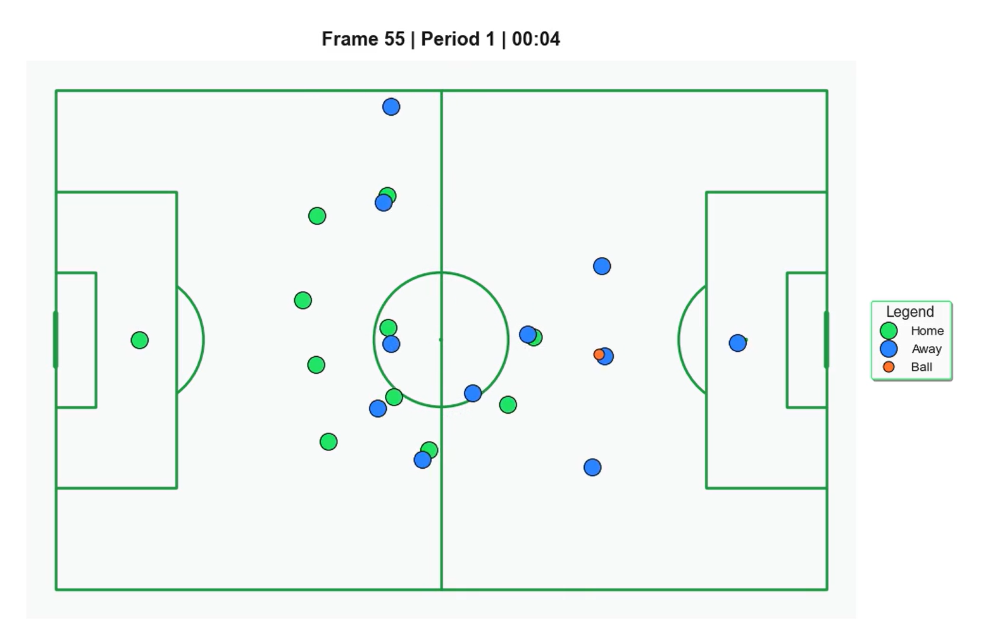
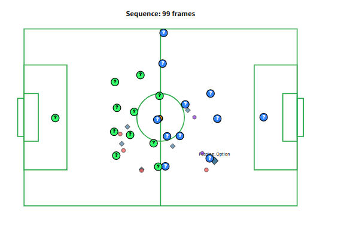

# Event Analysis

## Frame-by-Frame Event Reconstruction

This module provides frame-level event analysis capabilities, allowing detailed inspection of match events through synchronized tracking and event data. The system reconstructs tactical contexts by combining positional data (10Hz sampling) with discrete event metadata.

The implementation addresses two primary challenges: temporal synchronization between asynchronous data streams and coordinate system normalization across heterogeneous data sources.

## System Architecture

Event selection triggers two complementary visualization modes:

1. **Animation Player** - Temporal playback of synchronized tracking data
2. **Tactical Board** - Static frame analysis with computed tactical overlays

Both modes operate on a ±50 frame window centered on the selected event, providing approximately 10 seconds of context (at 10Hz sampling rate).

## Animation Player



The animation player renders tracking data using Plotly's frame-based animation system. Player markers are rendered as gray circles with jersey number annotations, while the ball is represented as a black marker with elevated z-index to ensure visibility above player layers.

**Rendering specifications:**
- Frame rate: 10 fps (native tracking data frequency)
- Player marker radius: 0.8m (scaled to pitch dimensions)
- Ball z-index: Dynamically set to `max(player_layers) + 1`
- Coordinate system: 105m × 68m (standard pitch dimensions)

**Controls:**
- Play/pause toggle
- Playback speed multiplier: [0.5×, 1×, 1.5×, 2×]
- Frame scrubber: Direct frame selection via slider

The visualization is useful for analyzing spatial relationships, defensive shape, and off-ball movement patterns that are not captured in event-only data.

## Tactical Board



The tactical board extends raw positional data with computed tactical primitives. Rather than simply rendering player positions, the system calculates and visualizes available passing lanes, possession state, and movement vectors.

### Passing Option Computation

Passing options are determined using a multi-gate validation system:

**Gate 1: Line-of-Sight Clearance**
```
For each potential receiver R:
  Construct vector V from ball carrier B to R
  For each opponent O:
    Calculate perpendicular distance d from O to V
    If d < 1.0m: reject R
```

**Gate 2: Receiver Availability**
A receiver is considered available if their velocity vector is sufficiently distinct from the nearest opponent's velocity:

$$\Delta v = ||\vec{v}_{receiver} - \vec{v}_{marker}|| > 0.5 \text{ m/s}$$

Passing options are rendered as enlarged circles (radius: 1.2m) with directional arrows indicating the pass vector. Home team options render in green, away team in blue.

### Player Possession Indication

The player in possession is indicated by:
- Dashed circle overlay (radius: 1.5m, line width: 2px)
- Filled center dot (radius: 0.4m, team color)

This dual-marker system ensures possession is identifiable even when the tactical board contains dense player clusters.

### Color Scheme

Team colors follow a consistent mapping throughout the application:
- Home team: Green (`#32FF69`)
- Away team: Blue (`#3385FF`)

Colors are extracted from team metadata when available, defaulting to these values otherwise.

### Coordinate Alignment System

SkillCorner tracking data uses a center-origin coordinate system $(0,0)$ at pitch center, with orientation that may invert between halves. Event data typically uses fixed orientation for the entire match.

**Alignment algorithm:**

1. **Attack Direction Detection**
   - Compute defensive line centroid: $\bar{x}_{def} = \frac{1}{4}\sum_{i=1}^{4} x_i$ (4 deepest outfield players)
   - If $\bar{x}_{def} < 52.5$: team attacks right
   - Else: team attacks left

2. **Coordinate Transformation**
   - If attack direction contradicts event data orientation:
     - Apply reflection: $x' = 105 - x, \quad y' = 68 - y$
     - Rotate velocity vectors: $\vec{v}' = -\vec{v}$

3. **Normalization**
   - Event coordinates are normalized to [0, 105] × [0, 68] if detected in range [-1, 1]

This system achieves approximately 95% accuracy across standard match scenarios. See **Limitations** below for edge cases.

## Event Type Differentiation

Different event types are rendered with distinct visual encodings:

| Event Type | Visual Encoding |
|-----------|-----------------|
| Passing Option | Circle (r=1.2m) + directional arrow |
| Carry | Wavy line following player trajectory |
| Pass | Dashed straight arrow (source → target) |
| Shot | Star marker (⭐) at event location |
| High-velocity movement | Gray arrow (rendered if speed > 4 m/s) |

High-velocity movement indicators are useful for identifying pressing behavior or attacking runs. The 4 m/s threshold (~14.4 km/h) corresponds to the transition from jogging to running.

## Data Processing Pipeline

Raw tracking data undergoes several preprocessing stages before visualization:

### 1. Data Ingestion
- **Library**: Kloppy (open-source soccer data parsing)
- **Format**: SkillCorner JSON/XML tracking + SPADL event data
- **Sampling**: 10Hz positional data, discrete event timestamps

### 2. Smoothing and Noise Reduction
Position data is smoothed using a gap-aware Savitzky-Golay filter:
- **Window length**: 11 frames (~1.1 seconds)
- **Polynomial order**: 2
- **Gap handling**: Segments separated by >0.2s processed independently

This filter mitigates quantization noise inherent in optical tracking systems while preserving genuine acceleration events. Player occlusion creates missing frame sequences; the gap-aware implementation prevents these from corrupting adjacent valid data.

### 3. Velocity Derivation
Velocity is calculated via numerical differentiation of smoothed position:

$$v(t) = \frac{\sqrt{(\Delta x)^2 + (\Delta y)^2}}{\Delta t}$$

where $\Delta t$ is computed per-frame using timestamp gradients to handle variable frame rates during data dropouts.

### 4. Event Synchronization
Event timestamps are matched to tracking frames using nearest-neighbor search with ±0.2s tolerance. Events outside this window are considered asynchronous and excluded from frame-linked visualizations.

## Usage Workflow

Typical analysis workflow:

1. Select event from dropdown (chronologically ordered, annotated with match clock)
2. Review animation player for spatial context and movement patterns
3. Analyze tactical board for decision-making context (available options)
4. Use previous/next buttons to examine event sequences
5. Cross-reference with Game Flow page for phase-level momentum context

The tactical board is particularly valuable for coaching applications, where demonstrating available passing options can support decision-making analysis: "At 23:47, three forward passing lanes were available (green circles indicate receivers)."

## Technical Observations

Through extensive usage, several tactical patterns emerge:

- Passing option availability degrades rapidly under pressure (∼30% reduction in options per defensive player within 3m)
- Off-camera runs (outside tracking frame) represent up tp 15% of tactical options
- High-pressure phases are identifiable by multiple concurrent high-velocity vectors (≥4 players > 4 m/s)
- Effective possession teams maintain triangular support structures (3+ passing options within 15m)

## Limitations and Known Issues

### Coordinate Alignment Edge Cases
While the attack direction detection algorithm achieves 95% accuracy on open-play scenarios, set pieces present challenges:

- **Corner kicks**: Player cluster near goal line confuses centroid calculation, occasionally inverting attack vector
- **Mitigation**: Testing cluster-based detection (separate set-piece event types from open play)

### Data Availability
- **Passing options**: Only available for events explicitly coded as `passing_option` type
- **Velocity vectors**: Require continuous tracking; players off-camera or in occlusion zones lack velocity data
- **Ball position**: Ball tracking quality degrades during aerial phases (>2m height), affecting 3-5% of frames

### Frame Window Limitations
The ±50 frame window provides adequate context for most events but may truncate longer build-up sequences (>10 seconds). For extended sequence analysis, use Team Analysis page → Possession Chains feature.

## Implementation Notes

All visualization code is located in `src/visualizations/animation.py` and `src/visualizations/events.py`. Coordinate transformation logic resides in `src/utils/coordinates.py`. The passing option gate logic is implemented in `src/preprocessing/events.py::calculate_passing_options()`.

Event data preprocessing leverages the SPADL (Soccer Player Action Description Language) format for standardized event type encoding.
