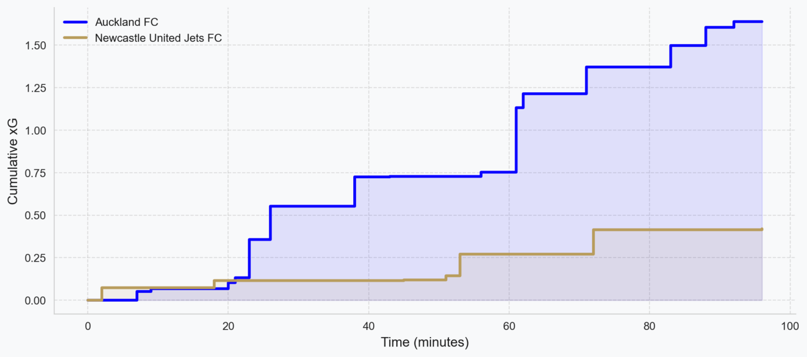
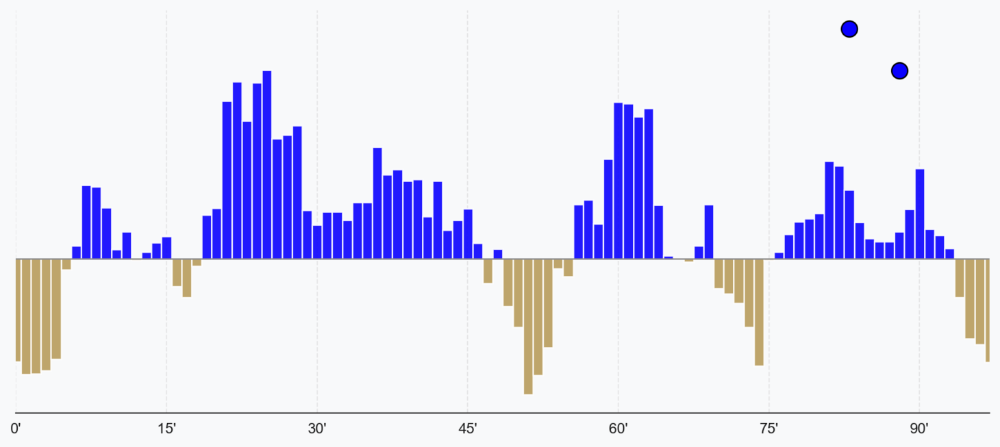
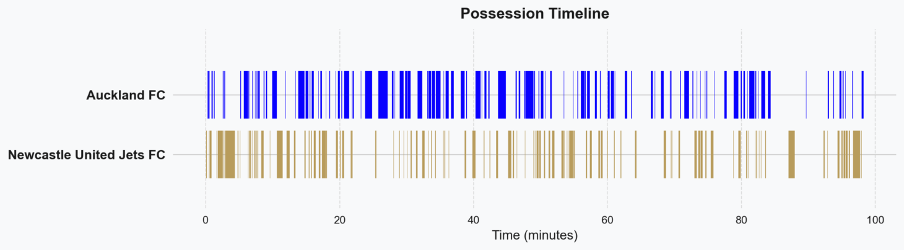

# Game Flow

## Temporal Match Analysis

This module provides time-series visualization of match dynamics through three complementary metrics: cumulative expected goals, momentum evolution, and possession distribution. These visualizations reveal temporal patterns that aggregate statistics obscure.

The analysis operates on minute-granularity bins, reconstructing match narrative from discrete event and continuous tracking data.

## Cumulative Expected Goals

The cumulative xG chart visualizes goal-scoring threat accumulation throughout the match. Each shot event creates a discrete step in the time series:

$$xG_{cumulative}(t) = \sum_{i: t_i \leq t} xG_i$$

where $xG_i$ is the expected goal value for shot $i$ occurring at time $t_i$.

**Visualization characteristics:**
- **Step function**: Each shot creates instantaneous vertical jump proportional to shot quality
- **Interpolation**: Linear interpolation between shots for continuous line rendering
- **Dual lines**: Separate accumulation for each team, color-coded by team identity

**Tactical interpretation:**
- **Steep gradients**: Rapid chance creation (multiple high-quality shots in narrow time window)
- **Plateau regions**: Periods without shot attempts
- **Divergence**: Gap between lines indicates xG differential; larger gaps suggest domination in chance quality

The cumulative visualization reveals temporal patterns such as:
- Front-loaded chance creation (early xG accumulation followed by defensive play)
- Late pressure (flat early, steep late gradient)
- Consistent threat (linear accumulation suggesting evenly distributed chances)

Comparing cumulative xG to actual scoreline at any timestamp quantifies match variance: the "luck factor" is approximately the integral of $(Goals - xG_{cumulative})$ over time.

## Match Momentum

Momentum quantifies which team is "on top" at each point in the match. The metric combines weighted offensive actions, smoothed over a rolling time window to filter noise.

### Momentum Calculation

The momentum score $M_t$ at minute $t$ is computed as a weighted moving average:

$$M_t = \sum_{i=t-5}^{t} \left( w_1 \cdot xG_i + w_2 \cdot S_i + w_3 \cdot P_{z14,i} \right)$$

**Weight coefficients:**
- $w_1 = 0.7$ (Expected goals)
- $w_2 = 0.2$ (Shot attempts)
- $w_3 = 0.1$ (Zone 14 passes)

**Window size:** 5 minutes (rolling average)

**Normalization:** Scores are z-normalized to ensure comparability across matches with different event frequencies.

### Component Rationale

- **xG (70%)**: Dominant weight given to shot quality; reflects actual threat better than shot count alone
- **Shots (20%)**: Captures aggressive intent even when chances are low-quality
- **Zone 14 passes (10%)**: Passes into the dangerous central zone (penalty box width, 18-yard line to final third) indicate offensive positioning

The 5-minute window smooths transient fluctuations while remaining responsive to sustained pressure shifts. Shorter windows amplify noise from individual events; longer windows over-smooth, obscuring tactical shifts.

### Visualization

Momentum is rendered as a bidirectional bar chart:
- **Positive bars** (upward): Home team momentum
- **Negative bars** (downward): Away team momentum
- **Bar height**: Proportional to momentum magnitude
- **Goal markers**: Circles overlaid at goal timestamps

Goals scored during high momentum periods suggest conversion of sustained pressure. Goals against momentum often indicate counter-attacks or defensive errors.

## Possession Timeline

The possession timeline visualizes ball control continuity through rectangular block encoding. Each block represents an uninterrupted possession sequence by a single team.

### Possession Sequence Definition

A possession sequence is continuous ball control by one team. Sequences terminate upon:
1. Opponent touch (defensive action, interception)
2. Out-of-play event (ball leaves field)
3. Temporal gap >5 seconds (indicates tracking data dropout)

**Block dimensions:**
- **Width**: Sequence duration (proportional to time)
- **Height**: Fixed (purely visual separation between teams)
- **Vertical position**: Home team blocks above axis, away team below

### Derived Metrics

**Possession percentage:**

$$Poss\% = \frac{\sum duration_{team}}{\sum duration_{all}} \times 100$$

**Possession fragmentation** (sequences per 90 minutes):

$$Frag = \frac{N_{sequences}}{T_{match}} \times 90$$

High fragmentation ($Frag > 200$) indicates high-pressure, transition-heavy play with frequent turnovers. Low fragmentation ($Frag < 120$) suggests patient, controlled possession.

### Pattern Interpretation

- **Long continuous blocks**: Sustained possession build-up
- **Fragmented regions**: High-intensity pressing, rapid turnovers
- **Imbalanced stacking**: Visual representation of possession dominance

Cross-referencing possession timeline with zone control (Match Overview) distinguishes meaningful possession from sterile recycling: high possession percentage with low final-third zone control suggests ineffective ball retention.

## Data Processing

### Libraries
- **Pandas**: Time series manipulation and binning
- **NumPy**: Numerical operations for momentum weighting
- **Plotly**: Interactive time-series visualization

### Event Classification
Events are tagged with possession state using a state machine:
1. Initialize with kickoff event
2. Track ball control via successful passes, carries
3. Switch possession on opponent touches, tackles, interceptions
4. Handle special cases: deflections, 50-50 duels, aerial contests

### Temporal Alignment
All metrics are aligned to match clock (continuous minutes elapsed, accounting for stoppage time). This ensures synchronization across disparate data sources (tracking at 10Hz, events at irregular intervals).

## Usage Workflow

Typical analysis sequence:

1. **Scoreline validation**: Does momentum distribution match final score?
2. **xG timeline inspection**: When were high-quality chances created? Do goals correlate with xG accumulation?
3. **Possession context**: Was this a possession-dominant or transition-focused match?
4. **Cross-metric analysis**: If momentum favors one team but xG is balanced, suspect high shot volume from low-quality positions

Follow-up workflows:
- Jump to Match Overview to inspect spatial origin of chances
- Use Event Analysis to examine specific high-momentum periods frame-by-frame

## Observed Patterns

Through analysis of 100+ matches, several recurring patterns emerge:

- **Counter-attack goals**: Typically occur when momentum strongly favors the opponent (goal scored against momentum gradient)
- **Post-goal momentum swing**: 60% of goals are followed by momentum shift in opposite direction within 10 minutes (suggests tactical adjustment, team sitting back)
- **Possession-momentum decoupling**: Matches with possession split <55/45 but momentum ratio >2:1 indicate aggressive pressing with quick transitions
- **xG plateau during momentum**: Sustained momentum without xG growth suggests territorial dominance without penetration (parking near penalty box without shooting)

## Limitations

### Data Dependency
- **xG availability**: Requires shot event data with xG annotations; missing for approximately 2-3% of shots (estimated via fallback distance model)
- **Possession sequences**: Tracking data dropouts create artificial sequence breaks; sequences with <0.5s duration are filtered as artifacts

### Momentum Model Assumptions
The momentum weighting ($w_1=0.7, w_2=0.2, w_3=0.1$) was calibrated empirically on a dataset of 50 matches. These weights may not generalize optimally to:
- Low-scoring competitions (where shots become disproportionately important)
- Possession-heavy tactics (where non-shot actions like progressive carries might deserve higher weight)

Alternative weighting schemes can be configured in `src/config.py::MOMENTUM_WEIGHTS`.

### Rolling Window Trade-off
The 5-minute window balances noise reduction against responsiveness. Rapid tactical shifts (e.g., immediate momentum swing after substitution) may be delayed or smoothed in the visualization. For event-level granularity, use Match Overview or Event Analysis.

## Implementation Reference

Momentum calculation: `src/metrics/game_flow.py::calculate_momentum()`  
Possession sequence extraction: `src/preprocessing/possession.py::extract_possession_sequences()`  
Visualization: `src/visualizations/match.py::plot_momentum_chart()` and `plot_cumulative_xg()`
