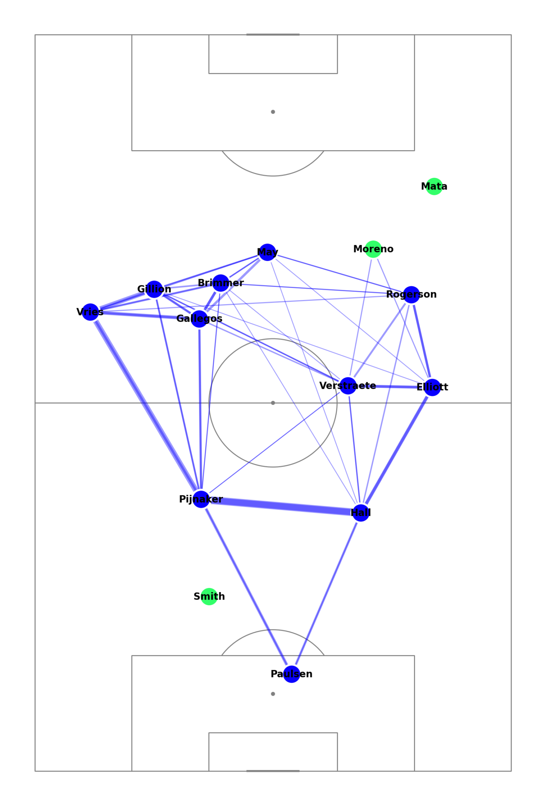
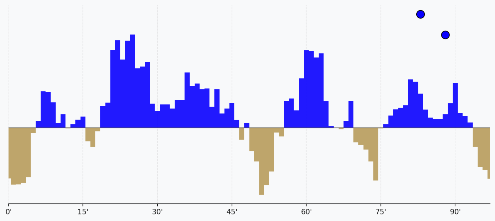
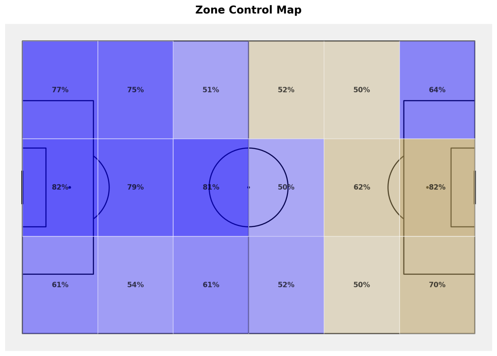
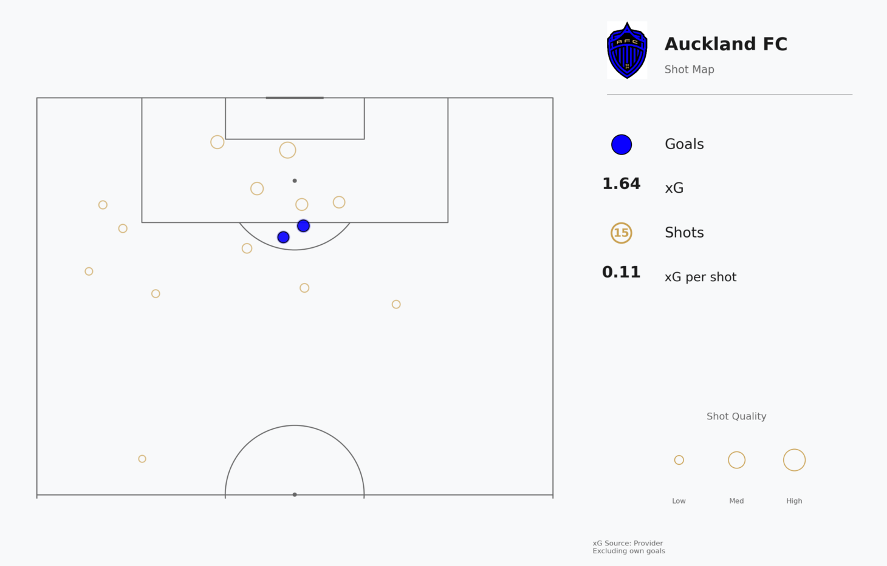

# Match Overview

## High-Level Match Intelligence

This page provides aggregate tactical metrics and spatial visualizations for the entire match. The analysis synthesizes event data (passes, shots, possession) with tracking data (player positions) to construct a comprehensive tactical summary.

The visualizations answer: How did teams approach the game? Where were chances created? Which areas were controlled?

## Scoreboard

The scoreboard displays final score, team identities, and team logos (when available in metadata). Team colors propagate consistently throughout the application: all visualizations use the same color mapping to ensure cognitive continuity.

Color extraction hierarchy:
1. Metadata-specified team colors (if present)
2. Logo-derived dominant colors (via k-means clustering on logo images)
3. Default fallback: Home = Green (`#32FF69`), Away = Blue (`#3385FF`)

## Pass Networks

Pass networks visualize how teams circulate the ball, revealing structural patterns and key connectors.

### Node Positioning

Nodes represent players, positioned at the spatial centroid of their touches:

$$(\bar{x}_i, \bar{y}_i) = \frac{1}{N_i} \sum_{j=1}^{N_i} (x_{ij}, y_{ij})$$

where $(x_{ij}, y_{ij})$ is the location of player $i$'s $j$-th touch, and $N_i$ is total touches.

**Note:** Nodes are **not** formation positions. A player nominally in a 4-3-3 left-wing position may have a centroid shifted centrally if they frequently cuts inside.

### Node Size

Node radius scales with touch count (square root scaling for perceptual accuracy):

$$r_i = r_{base} + k \cdot \sqrt{N_i}$$

where $r_{base} = 8$ pixels, $k = 1.5$ (scaling factor).

### Edge Encoding

Edges represent passes between players. Edge thickness scales linearly with pass frequency:

$$w_{ij} = w_{min} + \alpha \cdot P_{ij}$$

where:
- $w_{min} = 1$ pixel (minimum edge width)
- $\alpha = 0.3$ (scaling coefficient)
- $P_{ij}$ = number of passes from player $i$ to player $j$

**Edge threshold:** Only passes occurring $\geq 3$ times are rendered, filtering noise from accidental or rare connections.

### Color Scheme

- **Starting XI**: Team color (green for home, blue for away)
- **Substitutes**: Neutral color (`#A9A9A9` gray) to distinguish late-match dynamics

### Tactical Interpretation

Pass network structure reveals team tactics:
- **Clustered midfield nodes**: Indicates possession-based build-up through midfield
- **Isolated forward nodes**: Suggests direct/counter-attacking approach
- **Wide spread**: Stretch-the-field tactics, width exploitation
- **Strong triangular connections**: Positional play, creating passing triangles

## Match Momentum

Momentum chart shows temporal ebb-and-flow of match control. See [Game Flow](game_flow.md) for detailed momentum calculation.

**Formula summary:**

$$M_t = \sum_{i=t-5}^{t} \left( 0.7 \cdot xG_i + 0.2 \cdot S_i + 0.1 \cdot P_{z14,i} \right)$$

The 5-minute rolling window filters noise while remaining responsive to tactical shifts. Goal markers (circles) indicate scoring events, enabling correlation analysis between pressure and conversion.

## Zone Control

Zone control heatmaps spatial dominance by dividing the pitch into a regular grid and aggregating possession events within each cell.

### Grid Specification

- **Grid dimensions**: 6 longitudinal × 3 lateral = 18 zones
- **Zone size**: 17.5m × 22.67m
  - Longitudinal: 105m / 6 = 17.5m
  - Lateral: 68m / 3 ≈ 22.67m

### Intensity Calculation

For each zone $z$, intensity is computed as normalized event frequency:

$$I_z = \frac{E_z}{\max(E)}$$

where $E_z$ is the count of possession events (passes, carries, dribbles) occurring in zone $z$, and $\max(E)$ is the maximum event count across all zones.

Intensity values are mapped to color gradients:
- **Low intensity** (< 0.3): Transparent/light
- **Medium intensity** (0.3 - 0.7): Graduated team color
- **High intensity** (> 0.7): Saturated team color

### Interpretation

Zone control quantifies territorial dominance independently from possession percentage. Key scenarios:

- **High possession% + low final-third zone control**: Sterile possession in own half (recycling without progression)
- **Balanced possession + asymmetric zone control**: One team dominates dangerous areas despite equal ball time
- **Wide zone dominance**: Flank-oriented approach
- **Central zone dominance**: Through-the-middle tactics

Cross-reference with Pass Networks: if zone control is high but pass network shows few connections, suspect long-ball tactics bypassing midfield.

## Shot Maps

Shot maps visualize chance location and quality. Each shot is represented as a circle positioned at the shot origin.

### xG Data Source

Expected goal values follow a hierarchical sourcing strategy:

1. **Provider xG** (preferred): xG values directly from SkillCorner dataset
2. **Distance model** (fallback): Logistic regression model when provider xG is missing

**Distance-based xG model:**

$$xG = \frac{1}{1 + e^{-(\beta_0 + \beta_1 \cdot d + \beta_2 \cdot \theta)}}$$

where:
- $d$ = distance to goal center (meters)
- $\theta$ = angle to goal (radians, measured from shot location)
- $\beta_0 = 3.21, \beta_1 = -0.09, \beta_2 = 0.12$ (coefficients fitted on historical data)

Approximately 5-8% of shots require fallback estimation due to missing provider annotations.

### Circle Encoding

**Size:** Circle radius scales with shot quality (square root for perceptual linearity):

$$r_{shot} = r_{min} + k \cdot \sqrt{xG}$$

where $r_{min} = 4$ pixels, $k = 25$ (scaling factor).

**Color:**
- **Goals**: Filled circle in team color
- **Misses**: Hollow circle with bronze outline (`#CD7F32`)

### Statistics Panel

The adjacent panel displays aggregate shot metrics:
- **Goals**: Actual goals scored
- **Total xG**: Sum of expected goal values
- **Shots**: Total shot attempts
- **xG per shot**: Average shot quality ($\bar{xG} = \frac{\sum xG}{N_{shots}}$)
- **xG Source**: Indicator of primary xG source (Provider vs. Distance Model)

### Interpretation

Shot maps reveal tactical approach and finishing efficiency:

- **Clustered shots from box**: Indicates penetration and good chance creation
- **Dispersed long-range shots**: Suggests difficulty breaking down defense
- **Goals >> xG**: Clinical finishing or goalkeeping errors
- **xG >> Goals**: Wasteful finishing or excellent goalkeeping
- **High xG per shot**: Quality over quantity

## Match Statistics Table

Below visualizations, a comprehensive statistics table provides quantitative comparisons:

| Metric | Description |
|--------|-------------|
| Possession % | Percentage of time each team controlled the ball |
| Field Tilt | Percentage of events occurring in opponent's final third |
| Pass Accuracy | Successful passes / total passes |
| Progressive Passes | Passes advancing ball ≥10m toward goal |
| Dribbles | Successful dribble attempts |
| Tackles | Defensive tackles (successful + unsuccessful) |
| Interceptions | Ball recoveries via interception |

**Field tilt** deserves special attention. Unlike possession%, field tilt measures territorial dominance:

$$FieldTilt = \frac{\text{Events in opponent's final third}}{\text{Total events}} \times 100$$

**Thresholds:**
- **Aggressive** ($\geq 40\%$): High pressing, sustained final-third presence
- **Balanced** ($25\% - 40\%$): Standard approach
- **Defensive** ($< 25\%$): Counter-attacking, low block

Field tilt > Possession% suggests aggressive pressing without ball control. Possession% > Field tilt suggests cautious possession in own half.

## Usage Workflow

Recommended analysis sequence:

1. **Scoreline check**: Note final score
2. **Pass networks**: Identify team structures and key players
3. **Momentum**: Was the result consistent with temporal dominance?
4. **Zone control**: Compare spatial dominance to possession%
5. **Shot map**: Assess chance quality and finishing efficiency
6. **Statistics cross-reference**: Validate visual patterns with aggregate metrics

Follow-up navigation:
- Investigate temporal patterns → Game Flow page
- Drill into individual performances → Player Analysis
- Examine specific events → Event Analysis

## Data Processing

### Event Data
- **Source**: SkillCorner event stream (SPADL format)
- **Preprocessing**: Event coordinates normalized to 105×68 pitch
- **Filtering**: Invalid events (missing location, out-of-bounds) excluded (< 1% of events)

### Tracking Data
- **Source**: SkillCorner tracking data (10Hz)
- **Player positioning**: Average position weighted by time (longer presence = higher weight)

### Visualization Libraries
- **mplsoccer**: Soccer-specific plotting (pitch overlays, pass networks)
- **Plotly**: Interactive zone control and momentum charts
- **NetworkX**: Graph layout computation for pass networks (force-directed layout)

## Limitations

### Pass Network Spatial Accuracy
Centroid positioning assumes uniform time weighting. Players who spent most of the match in one area but had concentrated touches elsewhere will show biased centroids. For time-weighted positional analysis, use Team Analysis → Team Shape.

### Zone Control Granularity
18 zones provide coarse-grained spatial resolution. Fine-scale tactical nuances (e.g., half-space exploitation) may be missed. For higher resolution, use Player Analysis → Heatmaps (Gaussian KDE with variable bandwidth).

### xG Model Limitations
The distance-based fallback model ignores:
- Defensive pressure (number of defenders between shooter and goal)
- Shot body part (foot vs. header)
- Game state (losing teams may take lower-quality shots)

These factors can introduce -0.05 to +0.08 xG error per shot. For critical analyses, prefer matches with complete provider xG coverage.

## Implementation Reference

Pass network generation: `src/visualizations/passing.py::plot_pass_network()`  
Zone control calculation: `src/metrics/spatial.py::calculate_zone_control()`  
Shot map rendering: `src/visualizations/match.py::plot_shot_map()`  
xG fallback model: `src/metrics/xg.py::estimate_xg_from_distance()`
