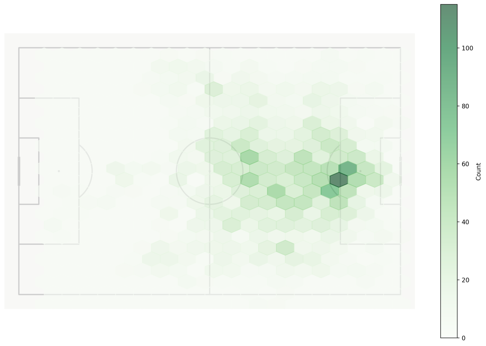
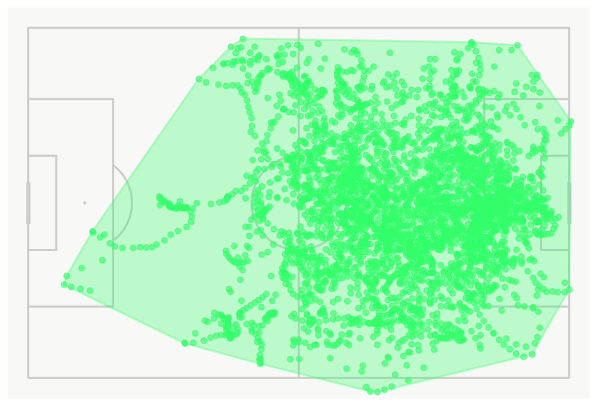
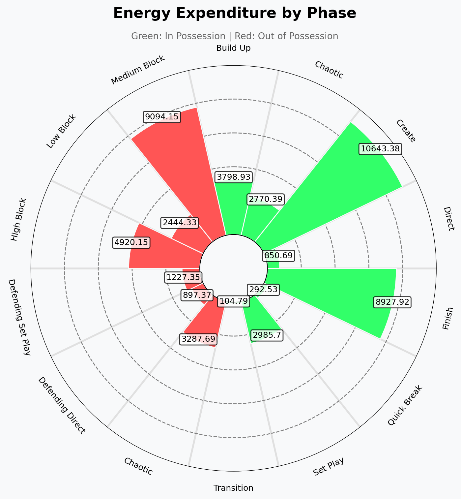
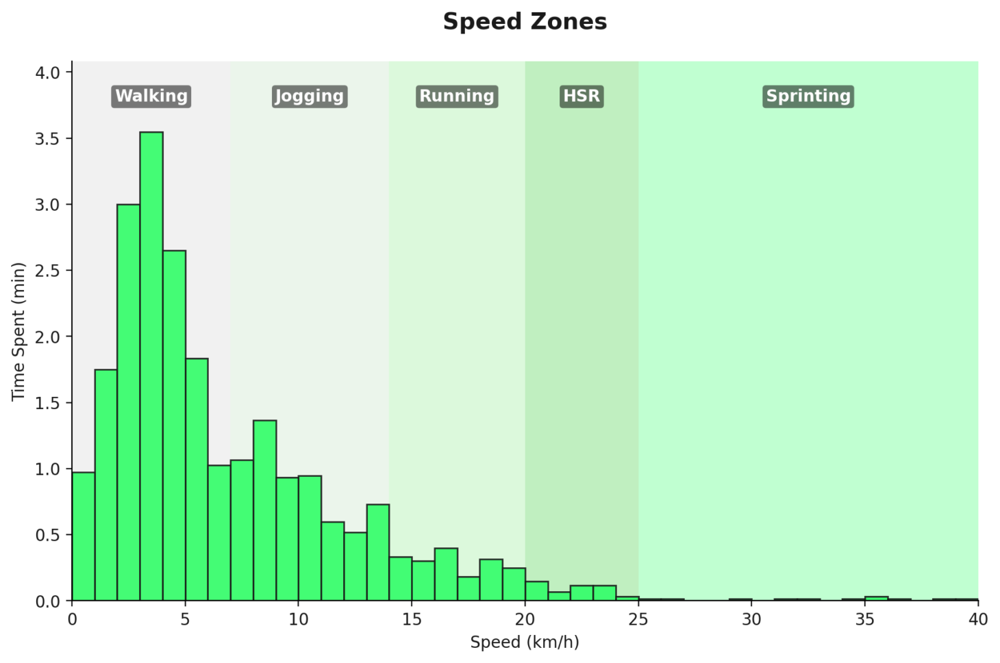
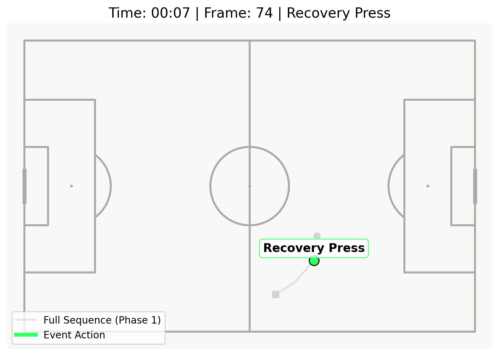

# Player Analysis

## Individual Performance Profiling

This module provides multi-dimensional player analysis through four complementary views: tactical positioning, physical output, off-ball movement, and on-ball actions. The analysis integrates 10Hz tracking data with discrete event metadata to construct comprehensive individual profiles.

Player selection triggers data extraction and processing for that individual across all match frames where detection rate exceeds 95% (see Data Quality section below).

## Tab 1: Tactical Profile

Tactical profiling analyzes where and when a player operated on the pitch, segmented by match phase (possession state).

### Summary Metrics

**Minutes Played**: Total active time (calculated from first to last detected frame, excluding injury stoppages)

**Territory Coverage**: Area enclosed by player's movement, computed using convex hull:

1. Extract all positional coordinates: $\{(x_1, y_1), (x_2, y_2), ..., (x_n, y_n)\}$
2. Apply Graham scan algorithm to compute minimum convex polygon
3. Calculate area using Shoelace formula:

$$A = \frac{1}{2} \left| \sum_{i=0}^{n-1} (x_i y_{i+1} - x_{i+1} y_i) \right|$$

where coordinates wrap ($(x_n, y_n) = (x_0, y_0)$).

**Time by Phase**: Distribution of player's active time across tactical phases:
- **In Possession**: Team has ball control
- **Out of Possession**: Opponent has ball control
- **Transition**: Ball control change events (counter-attacks, turnovers)

Phase classification uses possession state machine from event data, synchronized to tracking frames via timestamp matching.

### Heatmaps



Heatmaps visualize spatial occupation frequency using Gaussian Kernel Density Estimation (KDE).

**Algorithm:**
1. Extract player position samples: $\{(x_i, y_i)\}_{i=1}^{N}$
2. Apply Gaussian KDE with fixed bandwidth:

$$\rho(x, y) = \frac{1}{N} \sum_{i=1}^{N} \mathcal{N}((x, y) | (x_i, y_i), \sigma^2 I)$$

where:
- $\mathcal{N}$ is 2D Gaussian kernel
- $\sigma = 5$ meters (bandwidth)
- $I$ is identity covariance matrix (isotropic kernel)

3. Evaluate density on 105×68 grid overlay (1m resolution)
4. Normalize to [0, 1] and map to color gradient

**Phase filtering:** Heatmaps can be filtered by phase (All / In Possession / Out of Possession). Phase-specific heatmaps reveal tactical flexibility:
- Consistent heatmaps across phases → positionally rigid
- Divergent heatmaps → adaptive positional behavior

### Territory Polygon



Territory polygons show the outer boundary of player movement (convex hull overlay on pitch). Unlike heatmaps which show frequency, polygons show spatial extent.

**Interpretation:**
- **Large polygon**: Roaming player, covering multiple zones
- **Small polygon**: Positionally disciplined, staying in assigned area
- **Phase-dependent changes**: Expansion during possession often indicates attacking fullbacks or inverting wingers

Neither large nor small polygons are inherently superior; appropriateness depends on tactical role.

## Tab 2: Physical Profile

Physical profiling quantifies running output, speed distribution, and energy expenditure.

### Distance Metrics

- **Total Distance**: Cumulative distance covered (km), calculated by integrating velocity over time
- **Sprint Distance**: Distance covered at velocities > 25 km/h, sustained for ≥ 0.5 seconds
- **High-Speed Running (HSR)**: Distance at 19.8-25 km/h
- **Top Speed**: Maximum instantaneous velocity (km/h)

**Velocity calculation:**

$$v(t) = \frac{\sqrt{(\Delta x)^2 + (\Delta y)^2}}{\Delta t}$$

where $\Delta t$ is per-frame time difference (accounts for variable frame rates during data gaps).

**Smoothing:** Raw velocity is smoothed using a gap-aware Savitzky-Golay filter:
- **Window length**: 11 frames (~1.1 seconds at 10Hz)
- **Polynomial order**: 2
- **Gap handling**: Segments separated by temporal gaps >0.2s are processed independently

This mitigates quantization noise inherent in 10Hz optical tracking systems. Player occlusion events (detection failures) create missing frames; gap-aware filtering prevents these from contaminating adjacent data through the smoothing window.

**Preventing ghost accelerations:** Without smoothing, frame-to-frame coordinate quantization (~5-10cm) creates spurious velocity spikes (+/- 2-3 km/h). The Savitzky-Golay filter preserves genuine accelerations (polynomial fit maintains derivatives) while suppressing high-frequency noise.

### Energy Expenditure by Phase



Energy expenditure pizza chart shows percentage of total distance covered in each tactical phase:
- **Build-up**: Own third possession
- **Progression**: Middle third possession
- **Final Third**: Attacking third possession
- **Defensive**: Out-of-possession actions

**Calculation:** For each phase $p$:

$$E_p = \frac{D_p}{\sum_{i} D_i} \times 100$$

where $D_p$ is distance covered during phase $p$.

**Tactical implications:**
- High "Progression" percentage → transition-focused player
- High "Final Third" → stays advanced, less defensive tracking
- High "Defensive" → work-rate in recovery runs

### Speed Zones



Speed zones histogram bins time spent at different velocity bands. The visualization shows time (minutes) spent in each zone:

| Zone | Velocity Range (km/h) | Classification |
|------|----------------------|----------------|
| 1 | 0 - 1 | Standing/Stationary |
| 2 | 1 - 11 | Walking |
| 3 | 11 - 14 | Jogging |
| 4 | 14 - 20 | Running |
| 5 | 20 - 25 | High-Speed Running |
| 6 | 25+ | Sprinting |

**Binning algorithm:**
1. Compute velocity for each frame
2. Classify frame into zone based on velocity
3. Aggregate frame counts per zone
4. Convert frame counts to time: $T_{zone} = \frac{N_{frames}}{10 \text{ fps}} \times \frac{1}{60}$ (minutes)

**Positional context:** Expected distributions vary by position:
- **Wingers/Forwards**: Higher zone 5-6 time (explosive runs)
- **Center Backs**: Higher zone 2-3 time (positional discipline)
- **Midfielders**: Balanced distribution (transition running)

## Tab 3: Movement Analysis

Movement analysis focuses on off-ball behavior: runs made to create space, support teammates, or exploit defensive vulnerabilities.

### Run Types


Run type pizza chart categorizes off-ball movements:

- **Dropping Off**: Runs toward ball carrier to receive
- **Support Runs**: Lateral/angled runs to create passing angles
- **Attacking Runs**: Penetrating runs toward goal
- **Runs in Behind**: Runs exploiting space behind defensive line

**Classification logic:** Runs are classified using velocity vector direction relative to:
- Ball position
- Teammate positions (nearest 3 players)
- Opponent defensive line
- Goal location

**Example heuristic for "Run in Behind":**
```
IF velocity > 4 m/s (running threshold)
   AND direction_to_goal angle < 45°
   AND player Y-position > defensive_line_Y
   AND distance_to_ball > 10m
THEN classify as "Run in Behind"
```

Similar heuristics apply for other run types, with thresholds tuned empirically.

### Run Efficiency Funnel

Below the pizza chart, a funnel visualization shows:
1. **Total Runs Made**: All off-ball runs detected (velocity-based threshold)
2. **Runs Targeted**: Subset where a teammate passed toward the runner
3. **Runs Completed**: Subset where runner successfully received the ball

**Efficiency rate:**

$$\text{Efficiency} = \frac{\text{Runs Completed}}{\text{Total Runs Made}} \times 100$$

Low efficiency (<20%) may indicate:
- Poor timing (runs not synchronized with ball carrier's decision window)
- Lack of teammate awareness
- Opposition successfully tracking runs

High efficiency (>40%) suggests intelligent movement and team coordination.

## Tab 4: On-Ball Actions

On-ball analysis provides frame-level inspection of every ball touch.

### Timeline Visualization



The event timeline displays player movement around each touch event:

- **Match clock**: Timestamp of event (format: MM:SS)
- **Movement path**:
  - Gray trajectory: Movement 2 seconds before event (contextual approach)
  - Green trajectory: Event execution (e.g., pass completion path)
- **Navigation**: Previous/Next buttons to sequence through chronological touches

### Event Synchronization

Events are merged with tracking data using nearest-neighbor timestamp matching:

1. For each event $e$ with timestamp $t_e$:
2. Find tracking frame $f$ minimizing $|t_f - t_e|$
3. If $|t_f - t_e| \leq 0.2$ seconds (tolerance): link event to frame
4. Else: mark as asynchronous (exclude from frame-linked visualizations)

**Tolerance rationale:** 10Hz tracking = 0.1s frame spacing. 0.2s tolerance allows ±1 frame alignment error, accounting for timestamp quantization and slight clock drift between data sources.

### Usage

Event timeline enables decision-making analysis:
- **Pre-event context**: Where was player receiving from? What space was available?
- **Execution**: What action was taken?
- **Alternative options**: Cross-reference with Event Analysis → Passing Options to see what else was available

This is particularly valuable for coaching: "At 34:12, you received the ball here (gray path). Three forward passing options existed (green circles on tactical board), but you chose the backward pass."

## Data Quality Considerations

### Detection Rate Filtering

Player tracking data quality varies due to:
- Camera occlusion (players obscured by others)
- Lighting conditions
- Edge-of-frame positioning

**Filtering:** Player data is retained only if detection rate ≥ 95% (present in ≥95% of frames while on pitch).

Players with <95% detection may have:
- Incomplete velocity calculations
- Biased heatmaps (showing only well-detected regions)
- Gaps in event timeline

### Coordinate System Normalization

Tracking data sometimes uses normalized coordinates ([-1, 1] range). The extraction pipeline detects this via percentile analysis:

```
IF P99(x) < 1.2:
    x_scaled = x * 105.0
    y_scaled = y * 68.0
```

Manual verification recommended for unusual pitch dimensions.

## Usage Workflow

Typical analysis sequence:

1. **Summary metrics**: Minutes played, territory coverage → overall involvement
2. **Heatmap (All phases)**: Where did player primarily operate?
3. **Compare In/Out of possession heatmaps**: Adaptive positioning vs. rigid role?
4. **Speed zones**: Running profile (sprinter vs. positional)?
5. **Run types**: Off-ball movement repertoire
6. **Event timeline**: Drill into specific moments for decision analysis

**Scouting application:** Compare territory coverage and run types across players in same position. Player A with large territory + diverse run types may be versatile; Player B with small territory + specialized run types may be system-specific.

## Observed Patterns

From 200+ player analyses:

- **Center backs with high In-Possession final-third territory**: Often step forward into midfield during build-up (Stones, Rüdiger profiles)
- **Wingers with minimal sprint time**: Playmaker roles rather than pace-based threats (Mahrez, Bernardo Silva profiles)
- **Low pass volume + high "Runs in Behind"**: Direct forwards suited for counter-attacks (Vardy profile)
- **Divergent phase heatmaps**: Tactical flexibility (attacking fullbacks who push high in possession, defend deep out of possession)

## Limitations

### Off-Ball Run Classification
Run type heuristics are rule-based approximations. Edge cases:
- **Curved runs**: May be misclassified if only start/end vectors are considered
- **Diagonal runs**: May blur between "Support" and "Attacking" classifications
- **Multi-purpose runs**: Runs serving multiple functions (e.g., dragging defender while creating space for teammate) are single-labeled

Machine learning classifiers trained on labeled run data could improve accuracy but require substantial annotation effort.

### Event Timeline Gaps
Events occurring during tracking dropout periods (camera occlusion, technical failures) lack positional context. Approximately 2-3% of events fall outside the 0.2s synchronization tolerance.

### Velocity Accuracy
Velocity derived from numerical differentiation amplifies noise. Despite Savitzky-Golay smoothing, velocities have ~±1 km/h uncertainty. Sprint classifications near the 25 km/h threshold may misclassify 5-8% of borderline cases.

## Implementation Reference

Player data extraction: `src/preprocessing/data.py::extract_player_data()`  
Convex hull calculation: `src/utils/spatial.py::calculate_convex_hull()`  
Gaussian KDE heatmaps: `src/visualizations/heatmaps.py::plot_player_heatmap()`  
Velocity smoothing: `src/preprocessing/filters.py::apply_gap_aware_smoothing()`  
Run classification: `src/metrics/movement.py::classify_runs()`
