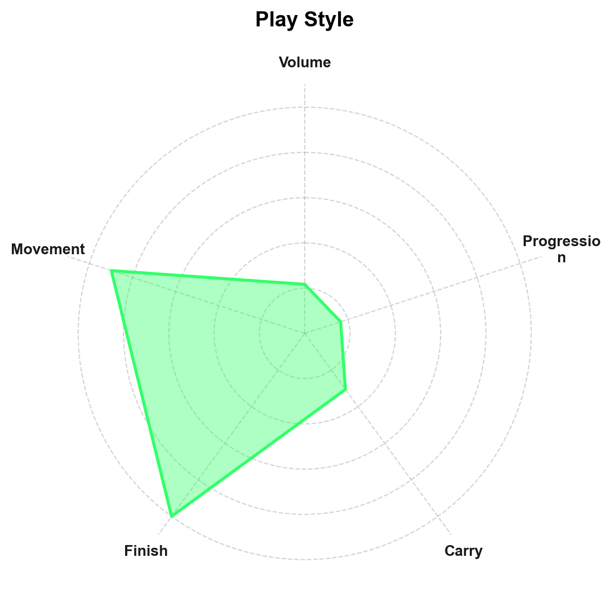
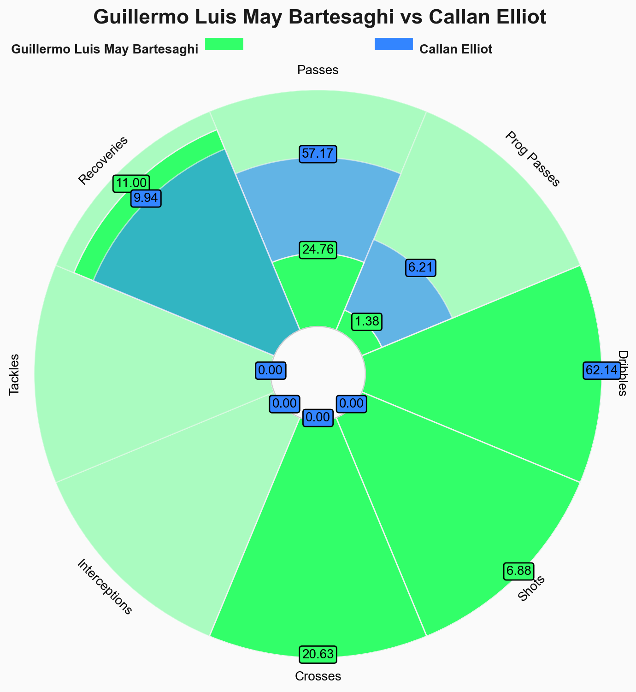
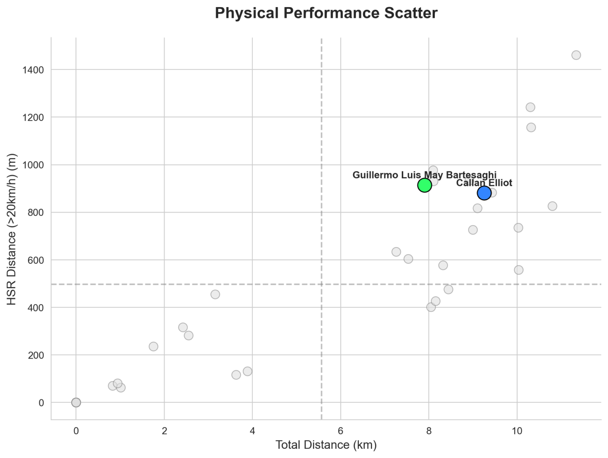
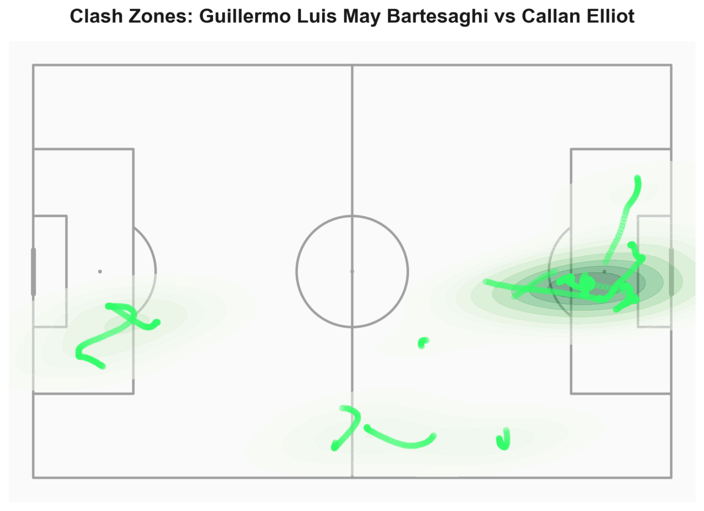
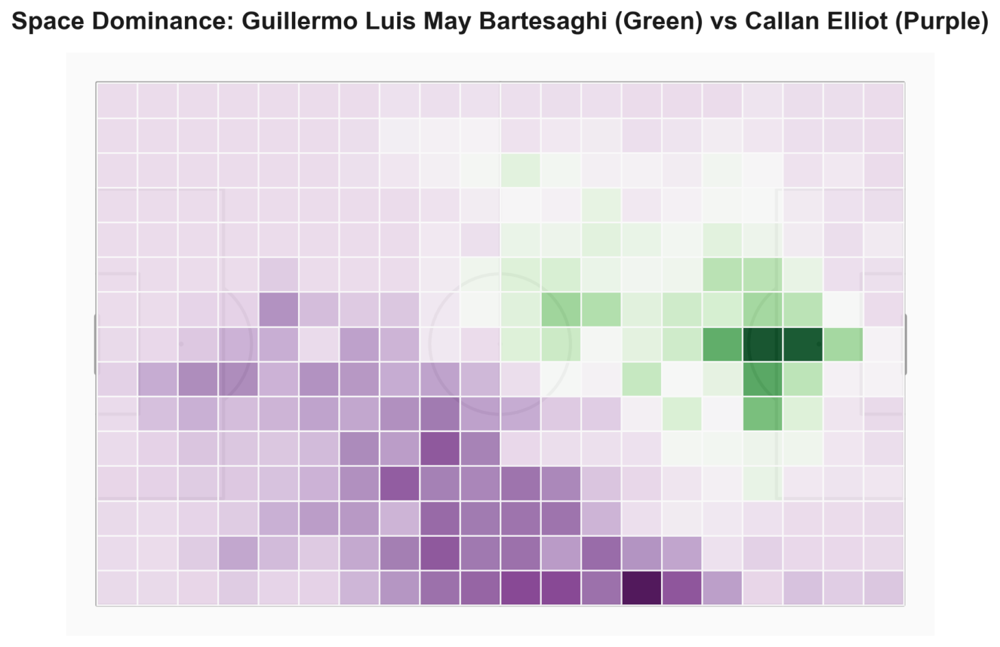
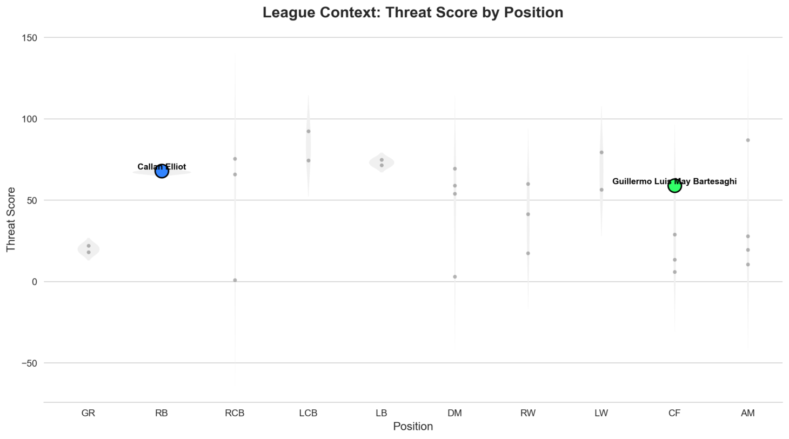

# Player Comparison

## Head-to-Head Tactical Analysis

This module enables direct comparison of two players through complementary analytical lenses: aggregate percentile rankings, split-state metrics, physical benchmarking, and spatial profiling. The analysis is designed for both scouting (evaluating potential recruits) and tactical matchup preparation (analyzing direct duels).

Player pair selection triggers computation of relative metrics, spatial overlap detection, and differential mapping.

## Pizza Chart: Percentile-Ranked Performance

The pizza chart provides visual comparison across 12 key performance metrics, with each metric percentile-ranked against a baseline population.

### Percentile Calculation

**Baseline dataset:** 450 midfielders and forwards from 2024/2025 competition season (N=450)

**Normalization:** All metrics normalized per 90 minutes to account for substitution variance:

$$\text{Metric}_{90} = \frac{\text{Metric}_{raw}}{\text{Minutes Played}} \times 90$$

**Percentile ranking:**

$$P_i = \frac{\text{Rank}(\text{Player}_i, \text{Metric})}{\text{N}_{baseline}} \times 100$$

where $\text{Rank}$ is ordinal position when baseline is sorted ascending by metric value.

### Metrics Included

| Metric | Definition | Unit |
|--------|-----------|------|
| Passes | Total completed passes | count/90 |
| Pass Accuracy | Successful passes / Attempts | % |
| Progressive Passes | Passes advancing ball ≥10m toward goal | count/90 |
| Carries | Continuous ball control while moving ≥5m | count/90 |
| Carry Distance | Total meters covered during carries | m/90 |
| xT (Expected Threat) | Cumulative threat value generated | xT/90 |
| Final Third Passes | Passes into attacking third | count/90 |
| Tackles | Defensive tackles (successful) | count/90 |
| Interceptions | Ball recoveries via interception | count/90 |
| Ground Duels Won | % of ground duels won | % |
| Aerial Duels Won | % of aerial duels won | % |
| Shots | Shot attempts | count/90 |

### Visualization Library

Built using `mplsoccer.PyPizza`, which handles:
- Polar coordinate projection
- Percentile-to-radius mapping
- Overlapping polygon rendering (Player A vs Player B)

### Interpretation

- **Polygon area**: Larger area indicates higher overall performance across metrics
- **Overlap regions**: Areas where players perform similarly
- **Gaps**: Metrics where one player significantly outperforms the other
- **Shape irregularity**: Specialization (spiky) vs. well-rounded (circular) profiles

## Detailed Metrics Table

Below the pizza chart, a tabular breakdown provides numerical values. Metrics are grouped by context:

### In Possession Metrics
Actions taken while player's team controls the ball:
- Pass volume, accuracy, progressive passes
- Carry frequency and distance
- Expected Threat (xT) generation
- Final third entries

### Out of Possession Metrics
Defensive actions:
- Tackles, interceptions
- Pressures (close-downs forcing opponent action)
- Defensive duel success rates

### Duel Metrics
Physical contests:
- Ground duels (50-50 challenges on ground)
- Aerial duels (headers, aerial contests)
- Win percentages for each category

### Physical Metrics
Running output:
- Total distance, sprint distance
- High-speed running (HSR) distance
- Top speed

Side-by-side presentation enables rapid identification of relative strengths and weaknesses.

## Physical Performance Scatter

The scatter plot positions all match participants in 2D physical space, highlighting the comparison pair.

**Axes (configurable):**
- X-axis: Total distance covered (km)
- Y-axis: Sprint distance (m) OR Top speed (km/h)

**Markers:**
- Comparison players: Highlighted with team colors and labels
- Other players: Gray markers (contextual population)

**Interpretation:** Scatter plots reveal outliers and positional norms. A midfielder covering 12km is typical; a striker covering 12km is exceptional. The scatter provides positional context missing from absolute values.

## Spatial Profiling

Spatial analysis reveals WHERE players operated, complementing the WHAT (metrics) and HOW MUCH (physical output).

### Clash Zones

Clash zones identify spatial regions where both players frequently operated, indicating areas of potential direct confrontation.

**Algorithm:**

1. Compute Gaussian KDE for each player:

$$\rho_A(x, y) = \frac{1}{N_A} \sum_{i=1}^{N_A} \mathcal{N}((x, y) | (x_i^A, y_i^A), \sigma^2 I)$$

$$\rho_B(x, y) = \frac{1}{N_B} \sum_{i=1}^{N_B} \mathcal{N}((x, y) | (x_i^B, y_i^B), \sigma^2 I)$$

where $\sigma = 5$ meters (bandwidth), $I$ is identity covariance.

2. Compute intersection probability density:

$$P_{clash}(x, y) = \min(\rho_A(x, y), \rho_B(x, y))$$

3. Threshold for visualization: Only regions where $P_{clash}(x,y) > 0.3$ are rendered.

**Interpretation:** High-intensity clash zones indicate areas where players contested the same space. For direct matchups (winger vs. fullback), clash zones reveal where most duels occurred. For teammates, clash zones may indicate positional overlap (potential tactical inefficiency).

### Space Dominance

Space dominance maps show which player controlled each spatial region more intensely, using a differential color scheme.

**Algorithm:**

1. Compute normalized dominance score:

$$D(x, y) = \frac{\rho_A(x, y) - \rho_B(x, y)}{\rho_A(x, y) + \rho_B(x, y)}$$

2. Apply threshold: Only regions where $|D(x,y)| > 0.2$ are colored (filters noise in low-density areas)

3. Color mapping:
   - $D > 0.2$: Player A color (proportional to dominance magnitude)
   - $D < -0.2$: Player B color (proportional to dominance magnitude)
   - $|D| \leq 0.2$: Neutral (no clear dominance)

**Interpretation:** Dominance maps reveal territorial specialization. Two midfielders with minimal spatial overlap are tactically complementary (one operates left, one right). Teammates with high overlap may indicate redundancy or positional indiscipline.

### Threat Score by Position

Threat maps visualize where each player generated offensive danger, quantified using Expected Threat (xT).

**Expected Threat Model:** xT values are sourced from Karun Singh's possession-value model, which assigns each pitch location a value representing the probability of scoring within the next N actions (typically N=3).

**Calculation:**
1. For each player action (pass, carry, shot) at location $(x, y)$:
2. Accumulate xT value: $xT_{total}(x,y) += xT_{action}$
3. Bin pitch into grid (10m × 10m cells)
4. Aggregate xT per cell
5. Render as heatmap (intensity ∝ cumulative xT)

**Interpretation:** Threat maps reveal spatial danger profiles:
- Forwards with similar total xT but different threat maps → complementary spatial roles (one works wide, one central)
- Concentrated high-threat zones → specialization (e.g., exploiting half-space)
- Distributed threat → versatile, unpredictable

## Tactical Comparison Use Cases

### Scouting Workflow
Evaluating potential recruits:

1. **Pizza chart**: High-level profile comparison
2. **Metrics table**: Verify numbers support visual impression
3. **Physical scatter**: Ensure work rate meets requirements
4. **Threat map**: Does danger creation align with tactical system needs?
5. **Space dominance**: Will operational zones fit current squad?

**Example:** Recruiting a winger to replace departing player. Pizza chart shows similar overall profile, but threat map reveals new candidate generates danger centrally while current player operates wide. Tactical adjustment required.

### Matchup Preparation
Preparing a defensive player to face an attacker:

1. **Clash zones**: Where will most duels occur?
2. **Pizza chart defensive metrics**: How strong is defender in relevant categories?
3. **Physical scatter**: Who has speed advantage?
4. **Threat map**: Where is attacker most dangerous?

**Example:** Fullback preparing to face winger. Clash zones show contests will occur in wide channel. Threat map shows winger cuts inside (high central threat). Defensive instruction: force wide, prevent inside cuts.

## Data Processing

### Baseline Dataset Construction
The 450-player baseline was constructed from:
- Competition: 2024/2025 season matches
- Minimum playing time: 450 minutes (≥5 complete matches)
- Positions: Midfielders, Forwards (defenders excluded due to different metric distributions)

Baseline is refreshed quarterly to maintain relevance.

### KDE Bandwidth Selection
$\sigma = 5$ meters was selected via cross-validation on historical data. Smaller bandwidths (3m) create over-segmented, noisy heatmaps. Larger bandwidths (7m+) over-smooth, losing spatial detail.

### Spatial Resolution
All spatial visualizations evaluate on a 105×68 grid with 1-meter resolution (7,140 cells). Higher resolutions provide marginal gains (~2% visual fidelity improvement) at 4× computational cost.

## Observed Patterns

From 100+ player comparisons:

- **Similar pizza charts, divergent spatial profiles**: Two players with similar aggregate statistics but different spatial footprints are often tactically complementary (e.g., partnered midfielders covering different zones)
- **High physical output without high threat**: Indicates inefficient running (covering ground without productive actions) — common in young, high-energy players lacking positional discipline
- **Unexpected clash zones**: Teammates with high clash zone intensity may indicate tactical confusion or role ambiguity (both attempting to occupy same space)
- **Asymmetric threat maps**: Players with similar xT totals but different spatial distributions are ideal for alternating in same position (opponent cannot prepare for single profile)

## Limitations

### Baseline Representativeness
The 450-player baseline is competition-specific. Percentiles are relative to this dataset, not universal "world football" rankings. A 90th percentile midfielder in League One is not comparable to 90th percentile in Premier League.

**Mitigation:** For cross-competition scouting, manually adjust expectations or construct competition-specific baselines.

### Spatial Data Sensitivity to Minutes Played
Players with low minutes (<200) may have biased spatial profiles. A substitute entering for 15 minutes against a fatigued opponent will have different movement profile than a starter. Heatmaps and dominance maps assume stable playing conditions.

**Threshold:** Spatial comparisons are most reliable for players with >400 minutes.

### KDE Assumption of Gaussian Distribution
Gaussian KDE assumes isotropic, normal spatial distribution. Players with bi-modal spatial profiles (e.g., switch-play wingers operating on both flanks) may be poorly represented. Mixture models could improve accuracy but increase complexity.

### xT Model Context-Independence
The Expected Threat model assigns fixed values to pitch locations, ignoring:
- Defensive pressure (number of opponents nearby)
- Game state (leading vs. trailing)
- Teammate positioning (supporting runs increasing action value)

These contextual factors can create ±0.05 xT/90 variance in player comparisons.

## Implementation Reference

Pizza chart generation: `src/visualizations/pizza.py::plot_comparison_pizza()`  
Clash zone computation: `src/metrics/spatial.py::calculate_clash_zones()`  
Space dominance: `src/metrics/spatial.py::calculate_space_dominance()`  
Threat mapping: `src/metrics/threat.py::calculate_threat_map()`  
Baseline percentile ranking: `src/metrics/player.py::calculate_percentiles()`
