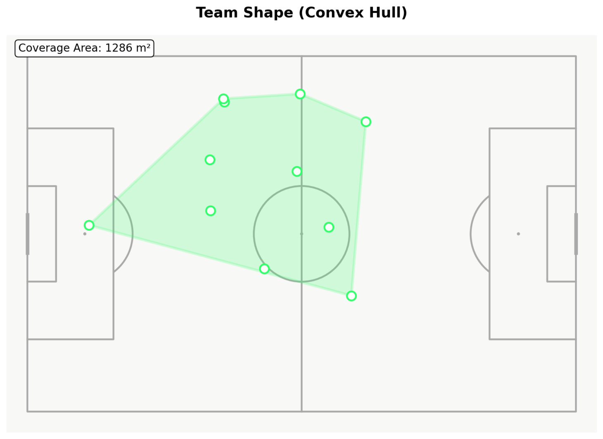
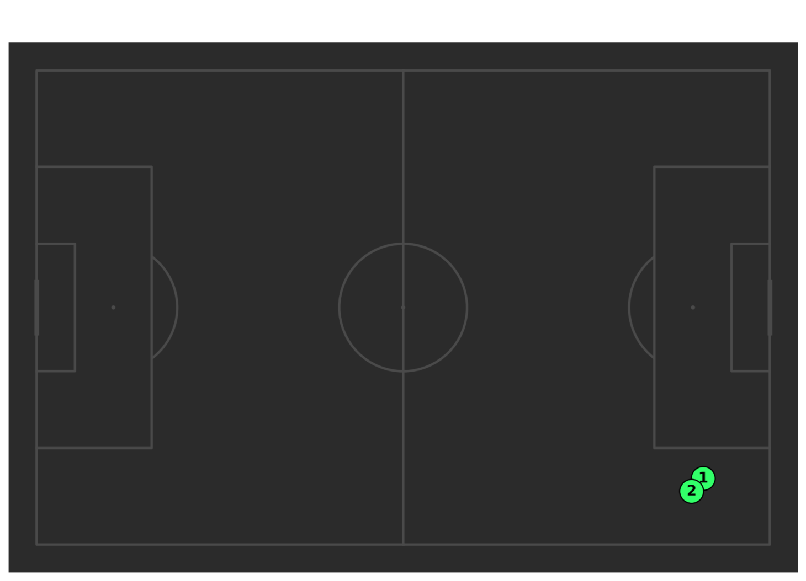
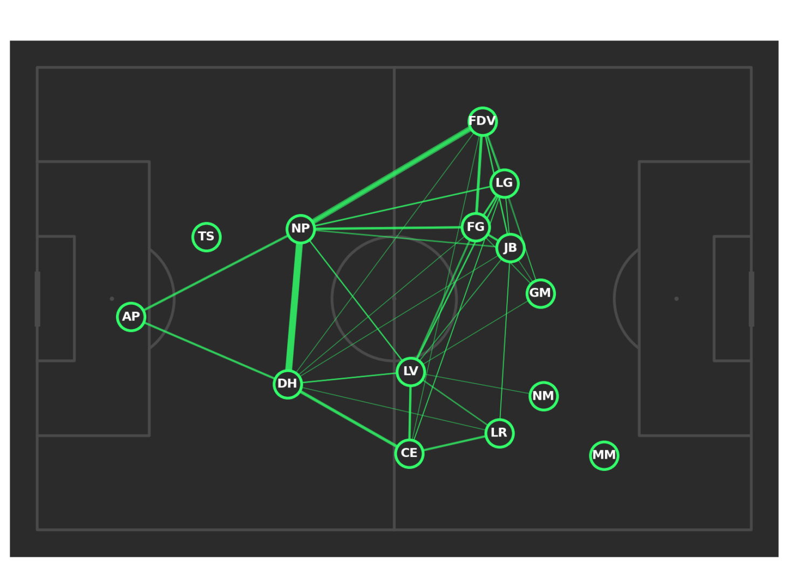

# Team Analysis

## Collective Tactical Profiling

This module analyzes team-level patterns: spatial organization, pressing intensity, build-up structure, and dangerous sequence identification. While Player Analysis examines individuals, this page zooms out to collective behavior and systemic tactics.

Team selection triggers aggregation of all players' tracking data and event sequences for that side.

## Field Tilt


Field tilt quantifies territorial aggression by measuring the proportion of events occurring in the opponent's final third.

### Calculation

$$\text{FieldTilt} = \frac{N_{events}(x > 70m)}{N_{events,total}} \times 100$$

where:
- $x > 70m$ corresponds to opponent's final third (pitch divided into thirds: 0-35m, 35-70m, 70-105m)
- Events include passes, carries, dribbles, shots, tackles (all recorded actions)

**Thresholds** (calibrated from historical dataset of 200+ matches):

| Field Tilt | Classification | Tactical Interpretation |
|-----------|---------------|-------------------------|
| ≥ 40% | Aggressive | High pressing, sustained final-third presence |
| 25-40% | Balanced | Standard approach, varies by game state |
| < 25% | Defensive | Counter-attacking, low block, ceding territory |

**Distinction from Possession%:** Possession measures ball control time; field tilt measures spatial dominance. A team can have 60% possession but 25% field tilt if most passes occur in their own half.

**Gauge visualization:** Rendered as radial gauge with color-coded zones (red=defensive, yellow=balanced, green=aggressive).

### Interpretation Context

Field tilt should be interpreted relative to:
- **Match state**: Trailing teams typically show higher tilt (chasing game)
- **Opposition quality**: Stronger opponents may force lower tilt regardless of intent
- **Tactical philosophy**: Some teams structurally prefer low tilt + transitions

Cross-reference with possession%:
- Tilt > Possession: Aggressive pressing without sustained control
- Possession > Tilt: Patient build-up from deep, reluctant to commit forward

## Team Shape



Team shape visualizes collective spatial organization using convex hull polygons. The polygon encloses all outfield players (goalkeeper excluded).

### Algorithm

1. For frame $f$, extract all outfield player positions: $\{(x_1, y_1), ..., (x_n, y_n)\}$ where $n=10$
2. Compute minimum convex polygon using Graham scan algorithm:
   - Sort points by polar angle relative to lowest point
   - Iteratively construct hull by maintaining left-turn property
3. Calculate polygon area using Shoelace formula:

$$A = \frac{1}{2} \left| \sum_{i=0}^{n-1} (x_i y_{i+1} - x_{i+1} y_i) \right|$$

4. Average area across all frames (or frame subset for phase-filtered analysis)

### Phase Filtering

Team shape can be filtered by tactical phase:

- **All**: Complete match (all frames)
- **In Possession**: Frames where team controls ball
- **Out of Possession**: Frames where opponent controls ball

**Tactical interpretation:**

| Pattern | In Possession Area | Out of Possession Area | Interpretation |
|---------|-------------------|------------------------|----------------|
| Adaptive | Large (e.g., 1200 m²) | Small (e.g., 800 m²) | Expand to attack, compress to defend |
| Rigid | ~1000 m² | ~1000 m² | Consistent structure regardless of phase |
| Inverted | Small | Large | Unusual; may indicate counter-attacking setup |

**Tactical quality:** Adaptive teams demonstrate phase-appropriate organization. Rigid teams may lack tactical flexibility OR be highly drilled in a specific system (both interpretations possible).

### Polygon Overlay

Polygon is rendered as translucent overlay on pitch, allowing visual assessment of:
- Longitudinal stretch (deep defensive line to high forwards)
- Lateral width (touchline-to-touchline spread)
- Asymmetry (unbalanced width, often due to ball-side overloads)

## Possession Chains



Possession chains reconstructs the event sequences preceding shots and goals, revealing tactical patterns in chance creation.

### Sequence Definition

A possession chain is a continuous series of events by one team. Chains terminate upon:

1. **Opponent touch**: Defensive action, tackle, interception
2. **Out-of-play**: Ball exits field (goal kick, throw-in, corner)
3. **Shot outcome**: Goal or shot ending possession
4. **Temporal gap**: >5 seconds between events (indicates data dropout or extended dead ball)

### Sequence Construction

Algorithm:
```
chains = []
current_chain = []

for event in events:
    if event.team == current_team AND time_gap < 5s:
        current_chain.append(event)
    else:
        if current_chain ends with shot/goal:
            chains.append(current_chain)
        current_chain = [event]
        current_team = event.team

sort chains by cumulative_xG (descending)
display top 10
```

### Visualization

For each sequence, the timeline shows:
- Event type icons (pass ➜, carry ↝, cross ⤻, shot ⚽)
- Player name (event executor)
- Event location (mini-pitch overlay)
- Outcome annotation (⚽ goal in green, shot in yellow)
- Timestamp and cumulative xG

**Sorting:** Sequences ranked by total xG (sum of xG for all shots in sequence), showing highest-quality chance-creation pathways first.

### Tactical Pattern Recognition

Patterns to identify:

- **Set-piece dominance**: If top sequences start with corners/free kicks, suggests open-play creation difficulties
- **Consistent initiators**: Repeated build-up through specific player (e.g., "80% of dangerous chains start with GK distribution to LB")
- **Sequence length**: Short chains (1-3 events) suggest direct play; long chains (8+ events) suggest possession-based build-up
- **Spatial patterns**: Chains consistently progressing down one flank indicate tactical asymmetry

**Opposition analysis application:** If analyzing upcoming opponent and observing "5 of top 10 sequences start with long ball to target striker," defensive instruction is clear: win first ball, pressure target striker.

## Defensive Structure

Defensive structure metrics quantify defensive line positioning and compactness.

### Defensive Line Height

**Definition:** Average Y-coordinate (distance from own goal) of the 4 deepest outfield players, excluding goalkeeper.

**Calculation per frame:**
1. Identify 4 players with lowest Y-coordinates (closest to own goal)
2. Compute mean: $\bar{y}_{def} = \frac{1}{4} \sum_{i=1}^{4} y_i$
3. Convert to distance from own goal: $h_{def} = \bar{y}_{def}$ (meters)

**Match average:** Mean across all frames

**Interpretation:**
- **High line** ($h > 45$ m): Aggressive positioning, squeezing pitch space
- **Medium line** ($35 < h < 45$ m): Balanced
- **Deep line** ($h < 35$ m): Defensive setup, protecting goal area

**Context:** High defensive lines enable offside traps and compress opponent space BUT are vulnerable to balls over the top. Deep lines are resilient to through balls BUT cede midfield territory.

### Defensive Line Width

**Definition:** Horizontal spread of the defensive line.

**Calculation:**
1. Identify same 4 defenders
2. Compute standard deviation of X-coordinates: 

$$w_{def} = \sigma_x = \sqrt{\frac{1}{4}\sum_{i=1}^{4}(x_i - \bar{x})^2}$$

**Interpretation:**
- **Narrow** ($\sigma < 12$ m): Compact, protecting central zones
- **Wide** ($\sigma > 18$ m): Stretched, covering full width

Width typically correlates with formation (narrow for 5-3-2, wide for 4-4-2) and game state (narrow when defending lead, wide when chasing).

### Box Plot Visualization

Defensive line height variation is rendered as box plot:
- **Median**: Central line (50th percentile height)
- **Q1/Q3**: 25th/75th percentile (interquartile range)
- **Whiskers**: Min/max (excluding outliers)
- **Outliers**: Individual frames >1.5 IQR from quartiles

**Consistency interpretation:**
- Narrow IQR (tight box): Disciplined, consistent line
- Wide IQR (tall box): Variable, adaptive to game situations OR lack of organization

## Pass Networks by Phase



Phase-specific pass networks reveal how team structure evolves across possession phases.

### Phase Definitions

- **Build-up**: Events in own third (X < 35m)
- **Progression**: Events in middle third (35m ≤ X < 70m)
- **Final Third**: Events in attacking third (X ≥ 70m)
- **All**: Complete match

### Network Construction

See [Match Overview](match_overview.md) for detailed node positioning and edge weight calculations. Key reminder:

- **Nodes**: Positioned at centroid of touches within phase
- **Edges**: Thickness ∝ pass frequency (minimum 3 passes for rendering)

### Comparative Analysis

Comparing networks across phases reveals tactical evolution:

**Example 1:** Tight triangular connections in build-up, but isolated forwards in final third
- **Interpretation**: Structured possession from back, but direct/long balls into attack

**Example 2:** Consistent network structure across all phases
- **Interpretation**: Positional play, maintaining passing patterns regardless of pitch zone

**Example 3:** Dense progression network, sparse final third network
- **Interpretation**: Strong midfield control, but struggle to break down set defenses

### Positional Shift Detection

If player node positions shift significantly across phases (e.g., fullback's centroid is at X=20m in build-up, X=55m in progression), indicates role flexibility (deeper when building, advanced when progressing).

## Data Processing

### Frame-Level Aggregation
Team shape calculation processes ~27,000 frames per match (90 minutes × 10 Hz × 30 fps). Computational optimization via:
- Downsampling to 5 Hz for shape calculation (negligible accuracy loss)
- Vectorized convex hull computation (NumPy operations)

### Phase Classification
Event phases classified using two criteria:
1. **Spatial**: Longitudinal position (X-coordinate thresholds)
2. **Possession**: Team controlling ball

Events are tagged during preprocessing; phase filtering is simple boolean indexing at visualization time.

### Libraries
- **SciPy**: Convex hull computation (`scipy.spatial.ConvexHull`)
- **NetworkX**: Pass network graph construction and layout
- **mplsoccer**: Soccer-specific pitch overlays

## Usage Workflow

Typical analysis sequence:

1. **Field tilt**: Assess territorial approach (aggressive vs. defensive)
2. **Team shape by phase**: Does team adapt structure? (expansive in possession, compact out?)
3. **Possession chains**: Identify dangerous patterns (set pieces, specific build-up routes)
4. **Defensive line**: High press or deep block?
5. **Pass networks across phases**: Does build-up structure match final-third approach?

**Pre-match preparation workflow:**
- Analyze upcoming opponent's top possession chains → identify attacking patterns to defend
- Check defensive line height → determine if through balls will be viable
- Compare phase-specific pass networks → identify key playmakers in each zone

## Historical Pattern Observations

From 150+ team analyses:

- **High field tilt + small out-of-possession shape**: Well-coordinated pressing teams (e.g., Klopp's Liverpool profile)
- **Set-piece-dominated possession chains**: Indicates struggles in open-play creativity (common in lower-tier teams facing superior opponents)
- **Defensive line >45m when trailing**: Desperation or stubborn tactical commitment
- **Networks more direct in final third**: Universal pattern — few teams maintain intricate passing under high pressure
- **Defensive width correlates with formation**: 5-back formations show $\sigma_x \approx 10-12$ m (narrow), 4-back show $\sigma_x \approx 15-18$ m (wide)

## Limitations

### Convex Hull Assumptions
Convex hull computes minimum enclosing polygon but:
- Excludes concave formations (e.g., W-shape with withdrawn striker)
- Sensitive to outliers (single advanced player inflates polygon)
- Assumes all 10 outfield players detected in frame

**Mitigation:** Alpha shapes (generalized hulls) could capture concavity but require parameter tuning ($\alpha$ threshold).

### Possession Chain Ambiguity
The 5-second temporal gap threshold balances two errors:
- Too short: Long passing sequences artificially split
- Too long: Unrelated sequences merged (e.g., team regains possession after brief opponent touch)

Edge cases (~3-5% of chains) may be misclassified at boundary conditions.

### Defensive Line Identification
The "4 deepest players" heuristic fails in:
- **Formations with 3-back**: 4th player may be midfielder, not defender
- **Asymmetric shapes**: Delayed fullback creates ambiguous selection

**Mitigation:** Formation-aware detection (identify actual defenders via role metadata) would improve accuracy but requires labeled data.

### Phase Classification Spatial Rigidity
Fixed thirds (0-35m, 35-70m, 70-105m) ignore pitch curvature and relative positioning:
- Midfield "progression" events at X=36m vs. X=69m are qualitatively different
- Opponent positioning (high press vs. low block) changes phase meaning

Adaptive phase boundaries based on opponent defensive line could improve semantic accuracy.

## Implementation Reference

Team shape calculation: `src/metrics/spatial.py::calculate_team_shape()`  
Convex hull: `scipy.spatial.ConvexHull` (third-party library)  
Possession chain extraction: `src/preprocessing/possession.py::extract_possession_chains()`  
Defensive line metrics: `src/metrics/defense.py::calculate_defensive_line()`  
Phase-specific networks: `src/visualizations/passing.py::plot_phase_network()`
